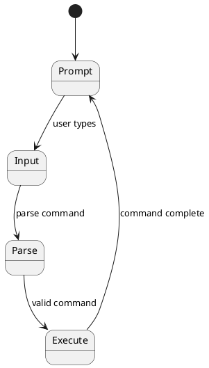
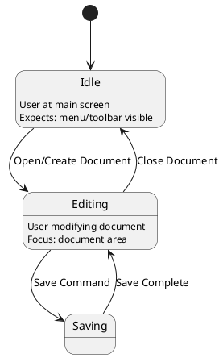
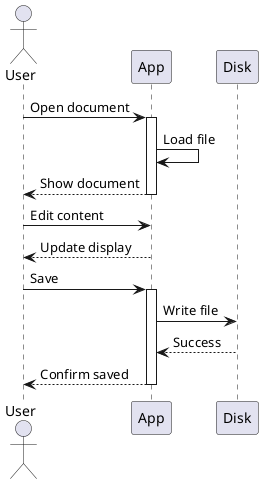
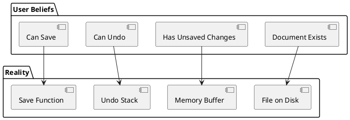

# UX IDE Project Roadmap
**User Experience Integrated Development Environment for Ultimate++**

---

## Project Overview

### Vision
Create a comprehensive tool for designing, analyzing, and generating GUI applications based on user state machines and user-centered design principles.

### Core Concept
- Applications are viewed as webs of user state machines
- Layouts are designed to support user mental models
- Bidirectional design process: User States ↔ Layouts ↔ Code
- AI-assisted analysis and generation

### Three Core Phases
1. **Phase 1**: XML Parsing → Value Objects → GUI Components
2. **Phase 2**: Layout design (splitters, panes, rectangles)
3. **Phase 3**: User state machine modeling (beliefs, expectations, navigation)

---

## Technical Architecture

### Framework: Ultimate++ Fork
- Base class: `Control` (all GUI widgets inherit from this)
- Need to inject virtual functions for semantic data dumping
- Use preprocessor macros to keep code clean
- Conditional compilation for debug/release builds

### Communication
- TCP or named pipe connection between target app and UX IDE
- Real-time data streaming
- Compact encoding (numeric IDs for efficiency)

### Data Model
- JSON format for internal data structures
- PlantUML diagrams for visualization
- Markdown files for documentation (initially planned, may be replaced by real-time editor)

---

## Version Roadmap

## **VERSION 0.x - FOUNDATION & INSTRUMENTATION**
*Goal: Get data out of applications, basic visualization, prove the concept*

---

### **Version 0.1 - Console Text Tracking**
*Start with simplest case: console applications*

#### **0.1.0 - ConsoleLayout Class Foundation**
**Goal:** Replace direct console output with semantic tracking

**Technical Details:**
- Create `ConsoleLayout` class in Ultimate++
- Define enum system for text IDs
- Each text output gets semantic identifier

**Implementation:**
```cpp
// Enum with registered strings
enum ConsoleTextID {
    TEXT_GREETING = 1,
    TEXT_PROMPT = 2,
    TEXT_ERROR = 3,
    TEXT_RESULT = 4,
    TEXT_HELP = 5
    // ... more IDs
};

class ConsoleLayout {
public:
    static void Print(ConsoleTextID id, const String& text);
    static void Register(ConsoleTextID id, const String& semantic_desc);
    static void Enable(bool enable);
    
private:
    static bool enabled;
    static VectorMap<int, String> registry;
};

// Usage - replace this:
Cout() << "Hello World\n";

// With this:
ConsoleLayout::Print(TEXT_GREETING, "Hello World");
```

**Deliverables:**
- ConsoleLayout.h and ConsoleLayout.cpp
- Example enum definitions
- Registration system
- Enable/disable mechanism

---

#### **0.1.1 - TCP/Pipe Communication**
**Goal:** Establish connection between console app and UX IDE

**Technical Details:**
- Implement TCP server in UX IDE
- Implement TCP client in ConsoleLayout
- Define wire protocol

**Wire Protocol:**
```
R:ID:Description    // Register text ID
T:ID:Text          // Text output event
C:Command          // Command input
E:Error            // Error message
```

**Example:**
```
R:1:Greeting message
R:2:User prompt
T:1:Hello World
T:2:Enter command:
C:help
T:5:Available commands: ...
```

**Deliverables:**
- TCP client code in ConsoleLayout
- Connection management (auto-reconnect, error handling)
- Protocol specification document
- Test harness for connection

**Configuration:**
```
Command-line flags:
--uxide-enable              // Enable UX IDE tracking
--uxide-host=localhost      // UX IDE host
--uxide-port=8080          // UX IDE port
--uxide-pipe=name          // Use named pipe instead
```

---

#### **0.1.2 - UX IDE Console Display**
**Goal:** Real-time visualization of console output

**Technical Details:**
- Build minimal UX IDE application (Ultimate++ or Qt)
- TCP server to receive data
- Display window with text view

**UI Layout:**
```
┌─────────────────────────────────────────┐
│ UX IDE - Console Tracker                │
├─────────────────────────────────────────┤
│ Connection: localhost:8080 [Connected]  │
├─────────────────────────────────────────┤
│ Console Output View                     │
│ ┌─────────────────────────────────────┐ │
│ │ [1:Greeting] Hello World           │ │
│ │ [2:Prompt] Enter command:          │ │
│ │ [User Input] help                  │ │
│ │ [5:Help] Available commands:       │ │
│ │   - open                           │ │
│ │   - save                           │ │
│ │   - quit                           │ │
│ └─────────────────────────────────────┘ │
│                                         │
│ Semantic IDs Panel                      │
│ ┌─────────────────────────────────────┐ │
│ │ 1: Greeting message                │ │
│ │ 2: User prompt                     │ │
│ │ 3: Error message                   │ │
│ │ 5: Help text                       │ │
│ └─────────────────────────────────────┘ │
└─────────────────────────────────────────┘
```

**Features:**
- Color-coded by semantic ID
- Timestamp for each event
- Scrollable output
- Search/filter by ID

**Deliverables:**
- UX IDE application skeleton
- TCP server implementation
- Console output display widget
- Semantic ID registry display

---

#### **0.1.3 - Timeline Recording**
**Goal:** Record and save console interaction sessions

**Technical Details:**
- Record all events with timestamps
- Save to JSON format
- Playback capability

**JSON Format:**
```json
{
  "session": {
    "start_time": "2025-11-12T10:30:00Z",
    "application": "MyConsoleApp",
    "version": "1.0"
  },
  "registry": {
    "1": "Greeting message",
    "2": "User prompt",
    "3": "Error message"
  },
  "events": [
    {
      "timestamp": "2025-11-12T10:30:01.234Z",
      "type": "text",
      "id": 1,
      "content": "Hello World"
    },
    {
      "timestamp": "2025-11-12T10:30:02.456Z",
      "type": "text",
      "id": 2,
      "content": "Enter command:"
    },
    {
      "timestamp": "2025-11-12T10:30:05.789Z",
      "type": "input",
      "content": "help"
    }
  ]
}
```

**Features:**
- Start/stop recording
- Save session to file
- Load and playback session
- Export to different formats

**Deliverables:**
- Session recording system
- JSON serialization
- File save/load
- Playback controls (play, pause, step, speed)

---

#### **0.1.4 - Real Application Testing**
**Goal:** Test with actual command-line program

**Test Application:**
- Simple file manager CLI
- Commands: ls, cd, open, edit, save, quit
- Error handling
- Help system

**Process:**
1. Instrument test application with ConsoleLayout
2. Define semantic IDs for all outputs
3. Run with UX IDE connected
4. Record session
5. Analyze patterns

**Success Criteria:**
- All text outputs tracked
- Commands captured
- Session records playable
- No performance degradation
- Clean enable/disable

**Deliverables:**
- Instrumented test application
- Test session recordings
- Performance benchmarks
- Bug fixes and optimizations

---

### **Version 0.2 - GUI Layout Tracking**
*Visualize GUI structure in real-time*

#### **0.2.0 - Control Base Class Modifications**
**Goal:** Add layout dumping capability to all GUI widgets

**Technical Details:**
- Modify Ultimate++ `Control` base class
- Add virtual functions for introspection
- Create macro system for clean implementation

**Base Class Changes:**
```cpp
// Add to Control base class
class Control {
public:
    // ... existing members ...
    
#ifdef UXIDE_DEBUG
    // Virtual functions for UX IDE
    virtual String UxIDE_GetClassName() const;
    virtual Value UxIDE_DumpLayout() const;
    virtual Value UxIDE_GetSemanticData() const;
    
    // Optional: Runtime semantic data storage
    Value semanticData;
#endif
};
```

**Macro System:**
```cpp
// Preprocessor macro for clean implementation
#ifdef UXIDE_DEBUG
  #define UXIDE_WIDGET(ClassName) \
    virtual String UxIDE_GetClassName() const override { \
      return #ClassName; \
    } \
    virtual Value UxIDE_DumpLayout() const override { \
      ValueMap layout; \
      layout("class", #ClassName); \
      layout("rect", GetRect()); \
      layout("visible", IsVisible()); \
      layout("enabled", IsEnabled()); \
      return layout; \
    }
#else
  #define UXIDE_WIDGET(ClassName)
#endif

// Usage in widget class:
class Button : public Control {
    UXIDE_WIDGET(Button)
    // ... rest of class ...
};
```

**Deliverables:**
- Modified Control base class
- UXIDE_WIDGET macro
- Documentation for adding to new widgets
- List of all widgets that need modification

---

#### **0.2.1 - Layout Serialization**
**Goal:** Serialize GUI layout to send over network

**Technical Details:**
- Recursively dump widget hierarchy
- Include position, size, class name
- Compact encoding

**Serialization Format:**
```cpp
// JSON structure
{
  "window": {
    "class": "TopWindow",
    "rect": [0, 0, 800, 600],
    "children": [
      {
        "class": "Button",
        "rect": [10, 10, 100, 30],
        "text": "Save",
        "enabled": true,
        "visible": true
      },
      {
        "class": "EditField",
        "rect": [10, 50, 780, 400],
        "text": "...",
        "has_focus": true
      }
    ]
  }
}
```

**Wire Protocol Extension:**
```
L:START             // Begin layout dump
W:class,x,y,w,h    // Widget: class name, rectangle
W:Button,10,10,100,30
W:EditField,10,50,780,400
L:END              // End layout dump
```

**Deliverables:**
- Layout dumping function
- JSON serialization
- Wire protocol implementation
- Incremental update support (only changed widgets)

---

#### **0.2.2 - Colored Rectangle Visualization**
**Goal:** Display GUI layout as colored rectangles in UX IDE

**Technical Details:**
- Render widget hierarchy
- Color-code by widget type
- Show hierarchy visually

**Display:**
```
┌─────────────────────────────────────────┐
│ Layout View                             │
│ ┌─────────────────────────────────────┐ │
│ │ Window (800x600)                   │ │
│ │ ┌─────┐                            │ │
│ │ │Btn  │  [Button - Blue]           │ │
│ │ └─────┘                            │ │
│ │ ┌───────────────────────────────┐  │ │
│ │ │                               │  │ │
│ │ │     EditField [Green]         │  │ │
│ │ │                               │  │ │
│ │ └───────────────────────────────┘  │ │
│ └─────────────────────────────────────┘ │
│                                         │
│ Widget Tree                             │
│ ┌─────────────────────────────────────┐ │
│ │ ▼ TopWindow                        │ │
│ │   ├─ Button "Save"                 │ │
│ │   └─ EditField                     │ │
│ └─────────────────────────────────────┘ │
└─────────────────────────────────────────┘
```

**Color Scheme:**
- Blue: Buttons, controls that trigger actions
- Green: Text input fields
- Yellow: Labels, static text
- Red: Error indicators
- Gray: Disabled widgets
- Purple: Containers (panels, groups)

**Deliverables:**
- Layout rendering widget
- Color scheme configuration
- Widget tree view
- Zoom/pan controls

---

#### **0.2.3 - Real-time Layout Updates**
**Goal:** Update visualization as GUI changes

**Technical Details:**
- Detect layout changes
- Send incremental updates
- Smooth animation of changes

**Change Detection:**
```cpp
class Control {
    void SetRect(const Rect& r) {
        if (r != rect) {
            rect = r;
#ifdef UXIDE_DEBUG
            if (UxIDE::IsEnabled()) {
                UxIDE::NotifyRectChanged(this, r);
            }
#endif
        }
    }
};
```

**Update Protocol:**
```
U:widget_id,x,y,w,h    // Update widget rectangle
A:widget_id,parent_id   // Add widget
D:widget_id             // Delete widget
V:widget_id,visible     // Visibility change
```

**Deliverables:**
- Change detection system
- Incremental update protocol
- Smooth animation in UX IDE
- Performance optimization (throttling)

---

#### **0.2.4 - Mouse Position Tracking**
**Goal:** Track where user points mouse (user looks there by rule)

**Technical Details:**
- Capture mouse position
- Send to UX IDE
- Display on layout view

**Important Rule:**
*User must point mouse where they look - this is explicitly communicated to the user when recording begins*

**Tracking:**
```cpp
void Control::MouseMove(Point p, dword keyflags) {
#ifdef UXIDE_DEBUG
    if (UxIDE::IsEnabled()) {
        UxIDE::NotifyMousePosition(this, p);
    }
#endif
    // ... existing code ...
}
```

**Wire Protocol:**
```
M:x,y              // Mouse position in window coordinates
M:x,y,widget_id    // Mouse over specific widget
```

**Visualization:**
```
Layout View with mouse cursor overlay
Red dot or crosshair showing mouse position
Trail showing recent mouse path
Highlight widget under mouse
```

**Deliverables:**
- Mouse tracking code
- Position streaming
- Cursor overlay in UX IDE
- Mouse trail visualization
- Heatmap generation (optional)

---

#### **0.2.5 - Focus Tracking**
**Goal:** Track which widget has keyboard focus

**Technical Details:**
- Capture focus events
- Correlate with layout
- Detect typing activity

**Focus Detection:**
```cpp
void Control::SetFocus() {
#ifdef UXIDE_DEBUG
    if (UxIDE::IsEnabled()) {
        UxIDE::NotifyFocusChanged(this);
    }
#endif
    // ... existing code ...
}

void EditField::Key(dword key, int count) {
#ifdef UXIDE_DEBUG
    if (UxIDE::IsEnabled()) {
        static Time last_key_time;
        Time now = GetSysTime();
        if (now - last_key_time < 500) { // Within 0.5 seconds
            UxIDE::NotifyUserTyping(this);
        }
        last_key_time = now;
    }
#endif
    // ... existing code ...
}
```

**Wire Protocol:**
```
F:widget_id        // Focus changed
K:widget_id        // Key pressed (user typing)
T:widget_id        // Typing detected (keys within 0.5s)
```

**User Activity Detection:**
- Text editor has focus + changes every 0.5s = user is typing
- This is important for understanding user state

**Deliverables:**
- Focus tracking implementation
- Typing detection
- Activity indicators in UX IDE
- Timeline of focus changes

---

### **Version 0.3 - Technical State Tracking (GUI)**
*Track code execution flow and state transitions*

#### **0.3.0 - UXIDE_STATE Macro System**
**Goal:** Instrument code with state logging points

**Technical Details:**
- Lightweight macro for state logging
- Minimal performance impact
- Easy to add throughout codebase

**Macro Definitions:**
```cpp
#ifdef UXIDE_DEBUG
  extern bool g_uxide_enabled;
  
  #define UXIDE_STATE(id, desc) \
    do { if (g_uxide_enabled) UxIDE::LogState(id, desc); } while(0)
  
  #define UXIDE_STATE_USER(id, desc) \
    do { if (g_uxide_enabled) UxIDE::LogState(id, desc, true, false); } while(0)
  
  #define UXIDE_STATE_BACKEND(id, desc) \
    do { if (g_uxide_enabled) UxIDE::LogState(id, desc, false, true); } while(0)
    
  #define UXIDE_STATE_BOTH(id, desc) \
    do { if (g_uxide_enabled) UxIDE::LogState(id, desc, true, true); } while(0)
#else
  #define UXIDE_STATE(id, desc)
  #define UXIDE_STATE_USER(id, desc)
  #define UXIDE_STATE_BACKEND(id, desc)
  #define UXIDE_STATE_BOTH(id, desc)
#endif
```

**Usage Examples:**
```cpp
void Button::LeftDown(Point p, dword keyflags) {
    UXIDE_STATE_USER(101, "Button::LeftDown");
    // ... button logic ...
}

void SaveDocument() {
    UXIDE_STATE_USER(201, "SaveDocument");
    // ... UI feedback ...
    
    UXIDE_STATE_BACKEND(301, "Database::SaveRecord");
    // ... database operation ...
}

void MenuBar::ProcessMenu() {
    UXIDE_STATE_USER(150, "MenuBar::Open");
    // ... menu logic ...
}
```

**Deliverables:**
- UxIDE namespace with state logging
- Macro definitions
- Usage guidelines document
- Performance benchmarks

---

#### **0.3.1 - State ID Registry**
**Goal:** Central registry of all state IDs and their meanings

**Technical Details:**
- Enum or define for state IDs
- Registration system
- Avoid ID conflicts

**State ID System:**
```cpp
// State ID ranges:
// 100-199: UI Events (clicks, key presses)
// 200-299: User Actions (save, load, delete)
// 300-399: Backend Operations (database, file I/O)
// 400-499: Navigation (menu, dialog)
// 500-599: Data Processing
// 600-699: Error Handling

enum StateID {
    // UI Events
    STATE_BUTTON_CLICK = 100,
    STATE_BUTTON_HOVER = 101,
    STATE_KEY_PRESS = 102,
    
    // User Actions
    STATE_SAVE = 200,
    STATE_LOAD = 201,
    STATE_DELETE = 202,
    
    // Backend
    STATE_DB_QUERY = 300,
    STATE_FILE_WRITE = 301,
    
    // ... more states ...
};

// Registration at startup:
void RegisterStates() {
    UxIDE::RegisterState(STATE_BUTTON_CLICK, "Button clicked", true, false);
    UxIDE::RegisterState(STATE_SAVE, "User saves document", true, false);
    UxIDE::RegisterState(STATE_DB_QUERY, "Database query", false, true);
    // ...
}
```

**Wire Protocol:**
```
SR:id:description:is_user:is_backend    // Register state
S:id                                     // State occurred
S:id:timestamp                          // State with timestamp
```

**Deliverables:**
- State ID enum system
- Registration API
- ID conflict detection
- Documentation generator (auto-generate state list)

---

#### **0.3.2 - User vs Backend State Flags**
**Goal:** Distinguish user-visible actions from backend processing

**Technical Details:**
- Tag each state as user-facing, backend, or both
- Help separate concerns in analysis

**Categories:**
1. **User States**: User-visible actions
   - Button clicks
   - Menu selections
   - Text input
   - Navigation

2. **Backend States**: Internal processing
   - Database queries
   - File I/O
   - Calculations
   - Network requests

3. **Both**: Actions that span both
   - Save operation (user action + file write)
   - Form submission (user action + network request)

**State Metadata:**
```cpp
struct StateInfo {
    int id;
    String description;
    bool is_user_facing;
    bool is_backend;
    String category;
    
    // Optional: Expected duration
    int expected_duration_ms;
};
```

**UX IDE Display:**
```
State Timeline:
[USER] Button Click → 
  [BOTH] Save Document →
    [BACKEND] Validate Data →
    [BACKEND] Database Write →
  [USER] Show Success Message
```

**Deliverables:**
- State classification system
- Filtering by type in UX IDE
- Separate user flow from backend flow views
- Duration tracking

---

#### **0.3.3 - State Transition Logging**
**Goal:** Record sequences of states (state machine)

**Technical Details:**
- Log state transitions
- Build graph of state flow
- Detect patterns

**Transition Recording:**
```cpp
class UxIDE {
    static int current_state;
    static Vector<StateTransition> transitions;
    
    static void LogState(int new_state, const String& desc, 
                        bool is_user, bool is_backend) {
        StateTransition trans;
        trans.from_state = current_state;
        trans.to_state = new_state;
        trans.timestamp = GetSysTime();
        trans.description = desc;
        trans.is_user = is_user;
        trans.is_backend = is_backend;
        
        transitions.Add(trans);
        current_state = new_state;
        
        SendToUxIDE(trans);
    }
};
```

**Wire Protocol:**
```
T:from_id:to_id:timestamp    // State transition
```

**State Graph:**
```
States form a directed graph:
  State A → State B
  State B → State C
  State B → State D
  State C → State E
```

**Deliverables:**
- Transition logging
- Graph construction
- Cycle detection
- Common path identification

---

#### **0.3.4 - UX IDE State Flow Display**
**Goal:** Visualize state transitions in real-time

**Technical Details:**
- Display state timeline
- Show current state
- Highlight user vs backend states

**Display Layout:**
```
┌─────────────────────────────────────────┐
│ Current State: [201] Save Document      │
├─────────────────────────────────────────┤
│ State Timeline                          │
│ ┌─────────────────────────────────────┐ │
│ │ 10:30:01 [100] Button Click        │ │ (Blue - User)
│ │ 10:30:01 [201] Save Document       │ │ (Blue - User)
│ │ 10:30:02 [300] Validate Data       │ │ (Gray - Backend)
│ │ 10:30:02 [301] Database Write      │ │ (Gray - Backend)
│ │ 10:30:03 [202] Show Success        │ │ (Blue - User)
│ │ ▼ Current                          │ │
│ └─────────────────────────────────────┘ │
│                                         │
│ State Flow Graph                        │
│ ┌─────────────────────────────────────┐ │
│ │   [100]                            │ │
│ │     ↓                              │ │
│ │   [201] ─→ [300] ─→ [301]         │ │
│ │     ↓                              │ │
│ │   [202]                            │ │
│ └─────────────────────────────────────┘ │
└─────────────────────────────────────────┘
```

**Features:**
- Real-time state updates
- Color coding (user/backend)
- Graph visualization
- Filter by category
- Search states

**Deliverables:**
- State timeline widget
- State flow graph renderer
- Filter controls
- Export to image/PDF

---

#### **0.3.5 - Technical State Graph Recording**
**Goal:** Save complete state machine for later analysis

**Technical Details:**
- Record all states and transitions
- Build graph structure
- Export for AI analysis

**Graph Format (JSON):**
```json
{
  "session": {
    "start_time": "2025-11-12T10:30:00Z",
    "application": "MyApp",
    "version": "1.0"
  },
  "states": {
    "100": {
      "id": 100,
      "description": "Button Click",
      "is_user": true,
      "is_backend": false,
      "occurrences": 15
    },
    "201": {
      "id": 201,
      "description": "Save Document",
      "is_user": true,
      "is_backend": false,
      "occurrences": 5
    }
  },
  "transitions": [
    {
      "from": 100,
      "to": 201,
      "count": 5,
      "avg_duration_ms": 50
    },
    {
      "from": 201,
      "to": 300,
      "count": 5,
      "avg_duration_ms": 100
    }
  ],
  "paths": [
    {
      "sequence": [100, 201, 300, 301, 202],
      "count": 4,
      "total_duration_ms": 2500
    }
  ]
}
```

**Graph Analysis:**
- Most common paths
- Bottlenecks (long transitions)
- Dead ends
- Cycles
- Entry/exit points

**Deliverables:**
- Graph data structure
- JSON export
- Analysis algorithms
- Path extraction
- Visualization export

---

### **Version 0.4 - Visual Data Extraction**
*Extract text and visual information from widgets*

#### **0.4.0 - Text Extraction from Widgets**
**Goal:** Get text content from labels, buttons, etc.

**Technical Details:**
- Extract visible text from all widgets
- Include in layout dump
- Track text changes

**Text Extraction:**
```cpp
class Label : public Control {
    UXIDE_WIDGET(Label)
    
    virtual Value UxIDE_GetSemanticData() const override {
        ValueMap data;
        data("text", text);
        data("font", GetFont().GetFaceName());
        data("color", GetColor());
        return data;
    }
};

class Button : public Control {
    UXIDE_WIDGET(Button)
    
    virtual Value UxIDE_GetSemanticData() const override {
        ValueMap data;
        data("text", label);
        data("tooltip", GetTooltip());
        return data;
    }
};
```

**Wire Protocol Extension:**
```
D:widget_id:key:value    // Data field
D:button_1:text:Save
D:button_1:tooltip:Save the current document
D:label_1:text:File Name:
```

**Deliverables:**
- Text extraction for all widget types
- Protocol extension
- Display in UX IDE
- Text search capability

---

#### **0.4.1 - Text Editor Content Changes**
**Goal:** Track when text fields change

**Technical Details:**
- Detect content modifications
- Correlate with typing activity
- Track cursor position

**Change Detection:**
```cpp
class EditField : public Control {
    String last_content;
    
    void OnContentChanged() {
        String new_content = GetText();
        if (new_content != last_content) {
#ifdef UXIDE_DEBUG
            if (UxIDE::IsEnabled()) {
                UxIDE::NotifyTextChanged(this, last_content, new_content);
            }
#endif
            last_content = new_content;
        }
    }
};
```

**Wire Protocol:**
```
TC:widget_id:old_len:new_len    // Text changed
TC:edit_1:0:5                    // Typed 5 characters
TC:edit_1:5:10                   // Typed 5 more
TC:edit_1:10:8                   // Deleted 2 characters
```

**Activity Detection:**
- Typing speed (WPM)
- Pauses (thinking?)
- Corrections/deletions
- Copy/paste events

**Deliverables:**
- Change tracking system
- Activity metrics
- Timeline visualization
- Text diff display

---

#### **0.4.2 - Bitmap Change Detection (Optional)**
**Goal:** Detect visual changes in widgets

**Technical Details:**
- Capture widget rendering
- Detect pixel changes
- Useful for custom-drawn widgets

**Change Detection:**
```cpp
class CustomWidget : public Control {
    void Paint(Draw& w) override {
#ifdef UXIDE_DEBUG
        if (UxIDE::IsEnabled() && UxIDE::ShouldCaptureFrame()) {
            Image img = CaptureImage();
            UxIDE::NotifyFrameChange(this, img);
        }
#endif
        // ... paint logic ...
    }
};
```

**Use Cases:**
- Canvas widgets
- Charts/graphs
- Custom controls
- Animation tracking

**Performance Considerations:**
- Sample rate (not every frame)
- Image compression
- Change threshold (only significant changes)

**Deliverables:**
- Frame capture system
- Change detection algorithm
- Compressed transmission
- Video recording capability

---

#### **0.4.3 - Combined Layout + Visual Data**
**Goal:** Unified view of structure and content

**Technical Details:**
- Merge layout info with visual data
- Complete widget state snapshot
- Searchable widget database

**Complete Widget State:**
```json
{
  "widget": {
    "id": "button_1",
    "class": "Button",
    "rect": [10, 10, 100, 30],
    "visible": true,
    "enabled": true,
    "has_focus": false,
    "text": "Save",
    "tooltip": "Save the current document",
    "style": {
      "background_color": "#0078D4",
      "text_color": "#FFFFFF",
      "font": "Segoe UI, 12pt"
    },
    "state": "normal",
    "parent": "toolbar_1"
  }
}
```

**UX IDE Enhanced Display:**
```
Widget Inspector:
┌─────────────────────────────────┐
│ Selected: Button "Save"         │
├─────────────────────────────────┤
│ Position: (10, 10)              │
│ Size: 100 x 30                  │
│ Text: "Save"                    │
│ Tooltip: "Save the current..."  │
│ State: Normal                   │
│ Visible: Yes                    │
│ Enabled: Yes                    │
│ Focus: No                       │
└─────────────────────────────────┘
```

**Deliverables:**
- Complete state capture
- Inspector widget
- Search/filter by properties
- Export widget catalog

---

### **Version 0.5 - Console State Tracking**
*Return to console apps with state machine tracking*

#### **0.5.0 - Command Loop Instrumentation**
**Goal:** Track command execution flow

**Technical Details:**
- Instrument command parsing
- Track command execution
- Record state transitions

**Command Loop:**
```cpp
void CommandLoop() {
    while (true) {
        UXIDE_STATE_USER(500, "CommandLoop::Prompt");
        ConsoleLayout::Print(TEXT_PROMPT, ">");
        
        String cmd = ReadCommand();
        UXIDE_STATE_USER(501, "CommandLoop::Input");
        
        if (cmd == "quit") {
            UXIDE_STATE_USER(502, "CommandLoop::Quit");
            break;
        }
        
        UXIDE_STATE(510, "CommandLoop::Parse");
        Command parsed = ParseCommand(cmd);
        
        UXIDE_STATE_USER(511, "CommandLoop::Execute");
        ExecuteCommand(parsed);
    }
}

void ExecuteCommand(const Command& cmd) {
    UXIDE_STATE(520, Sprintf("Execute: %s", cmd.name));
    
    if (cmd.name == "save") {
        UXIDE_STATE_USER(521, "Command::Save");
        UXIDE_STATE_BACKEND(530, "File::Write");
        // ... save logic ...
    }
    // ... more commands ...
}
```

**State Machine:**
```
Console App States:
  [500] Prompt
    ↓ (user types)
  [501] Input Received
    ↓ (parse)
  [510] Parse Command
    ↓
  [511] Execute
    ↓
  [52x] Specific Command States
    ↓
  [500] Back to Prompt
```

**Deliverables:**
- Command loop instrumentation
- State definitions
- Flow visualization
- Command statistics

---

#### **0.5.1 - Input/Output Correlation**
**Goal:** Match user inputs with program outputs

**Technical Details:**
- Track input-output pairs
- Measure response time
- Identify patterns

**Correlation:**
```json
{
  "interaction": {
    "timestamp": "2025-11-12T10:30:01Z",
    "input": {
      "command": "save test.txt",
      "state": 501
    },
    "processing": [
      {"state": 510, "duration_ms": 5},
      {"state": 521, "duration_ms": 10},
      {"state": 530, "duration_ms": 150}
    ],
    "output": {
      "text": "File saved successfully",
      "text_id": 6,
      "state": 540
    },
    "total_duration_ms": 165
  }
}
```

**Analysis:**
- Input → Output latency
- Common command sequences
- Error rate by command
- User wait times

**Deliverables:**
- Correlation tracking
- Latency measurement
- Pattern detection
- Performance reports

---

#### **0.5.2 - Console State Machine**
**Goal:** Build complete state machine for console app

**Technical Details:**
- Map all possible states
- Define valid transitions
- Document state meanings

**State Machine Definition:**
```json
{
  "state_machine": {
    "states": {
      "500": {
        "name": "Prompt",
        "type": "user",
        "description": "Waiting for user input"
      },
      "501": {
        "name": "Input",
        "type": "user",
        "description": "User entered command"
      },
      "510": {
        "name": "Parse",
        "type": "backend",
        "description": "Parsing command"
      }
    },
    "transitions": {
      "500->501": "User types command",
      "501->510": "Begin parsing",
      "510->511": "Command recognized",
      "511->52x": "Execute specific command"
    },
    "entry_state": 500,
    "exit_states": [502]
  }
}
```

**Visualization:**
```
State Machine Diagram:
  
  ┌──────────────┐
  │ [500] Prompt │ ← Entry
  └──────┬───────┘
         │ user types
  ┌──────▼───────┐
  │ [501] Input  │
  └──────┬───────┘
         │ parse
  ┌──────▼───────┐
  │ [510] Parse  │
  └──────┬───────┘
         │
    ┌────┴────┐
    │         │
┌───▼──┐  ┌──▼───┐
│Save  │  │Open  │
└───┬──┘  └──┬───┘
    │        │
    └────┬───┘
         │
  ┌──────▼───────┐
  │ [500] Prompt │ ← Loop back
  └──────────────┘
```

**Deliverables:**
- State machine documentation
- Diagram generation
- State validation
- Export to PlantUML

---

#### **0.5.3 - User Interaction Patterns**
**Goal:** Identify common user workflows

**Technical Details:**
- Analyze command sequences
- Find common patterns
- Detect user habits

**Pattern Analysis:**
```json
{
  "patterns": [
    {
      "name": "Save workflow",
      "sequence": ["edit", "save", "verify"],
      "frequency": 45,
      "avg_duration_s": 12.5
    },
    {
      "name": "Search and open",
      "sequence": ["search", "open", "edit"],
      "frequency": 32,
      "avg_duration_s": 8.3
    }
  ],
  "user_metrics": {
    "most_used_commands": [
      {"command": "save", "count": 125},
      {"command": "open", "count": 98},
      {"command": "edit", "count": 87}
    ],
    "error_rate": 0.05,
    "avg_session_duration_m": 15.2
  }
}
```

**Deliverables:**
- Pattern detection algorithms
- Workflow identification
- User metrics dashboard
- Recommendations for UI improvements

---

### **Version 0.6 - Integration & Polish**
*Bring everything together*

#### **0.6.0 - Combined Console + GUI Tracking**
**Goal:** Track both console and GUI in same application

**Technical Details:**
- Applications might have both console and GUI
- Unified state tracking
- Consistent visualization

**Hybrid Application:**
```cpp
void HybridApp::Run() {
    // Console startup
    UXIDE_STATE_USER(600, "App::ConsoleStart");
    ConsoleLayout::Print(TEXT_GREETING, "Starting application...");
    
    // Initialize GUI
    UXIDE_STATE(610, "App::InitGUI");
    TopWindow win;
    win.Title("My Application");
    
    // Main loop tracks both
    UXIDE_STATE_USER(620, "App::MainLoop");
    win.Run();
}
```

**UX IDE Unified View:**
```
┌─────────────────────────────────────────┐
│ Application View                        │
├────────────────┬────────────────────────┤
│ Console Output │ GUI Layout             │
│                │                        │
│ [Greeting]     │ ┌────────────────┐    │
│ Starting...    │ │  Main Window   │    │
│                │ │  ┌──────┐      │    │
│ [Status]       │ │  │Button│      │    │
│ GUI Ready      │ │  └──────┘      │    │
│                │ └────────────────┘    │
├────────────────┴────────────────────────┤
│ State Timeline                          │
│ [600] ConsoleStart → [610] InitGUI →   │
│ [620] MainLoop                          │
└─────────────────────────────────────────┘
```

**Deliverables:**
- Unified tracking
- Combined visualization
- Correlation between console/GUI events
- Seamless mode switching

---

#### **0.6.1 - Playback/Replay Capability**
**Goal:** Replay recorded sessions for analysis

**Technical Details:**
- Load recorded session
- Replay events in real-time or step-by-step
- Interactive scrubbing

**Playback Features:**
```
Playback Controls:
┌─────────────────────────────────────────┐
│ ◄◄ ◄ ▶ ▶▶ │ [========○=====] 1x      │
│ Step  Play   Timeline       Speed      │
└─────────────────────────────────────────┘

Speed options: 0.25x, 0.5x, 1x, 2x, 4x

Step modes:
- Step Event: Next/previous event
- Step State: Next/previous state change
- Step Second: Move by 1 second
```

**Interactive Analysis:**
- Pause at any point
- Inspect widget states
- View call stack at that moment
- Add annotations

**Deliverables:**
- Playback engine
- Timeline scrubber
- Speed controls
- Frame-by-frame stepping
- Annotation system

---

#### **0.6.2 - Export Recorded Sessions**
**Goal:** Export sessions in multiple formats

**Technical Details:**
- JSON (for AI analysis)
- PlantUML (for diagrams)
- Video (for presentations)
- HTML (for reports)

**Export Formats:**

**1. JSON (Complete Data)**
```json
{
  "session": {...},
  "layout_snapshots": [...],
  "state_transitions": [...],
  "user_interactions": [...],
  "visual_data": [...]
}
```

**2. PlantUML (State Machine)**


**3. Video (Screen Recording)**
- Layout visualization animated
- State transitions highlighted
- Mouse cursor path shown

**4. HTML Report**
```html
<html>
<head><title>Session Report</title></head>
<body>
  <h1>Session Analysis</h1>
  <h2>Statistics</h2>
  <ul>
    <li>Duration: 15 minutes</li>
    <li>States visited: 45</li>
    <li>User actions: 23</li>
  </ul>
  <h2>State Machine</h2>
  
  <h2>Timeline</h2>
  <!-- Interactive timeline -->
</body>
</html>
```

**Deliverables:**
- Export system
- Format converters
- Template system
- Batch export

---

#### **0.6.3 - Performance Optimization**
**Goal:** Minimize overhead of tracking

**Technical Details:**
- Reduce memory usage
- Optimize network traffic
- Minimize CPU impact
- Conditional compilation

**Optimization Strategies:**

**1. Sampling**
```cpp
// Don't capture every mouse move
static int mouse_sample_counter = 0;
if (++mouse_sample_counter % 5 == 0) {
    UxIDE::NotifyMousePosition(this, p);
}
```

**2. Buffering**
```cpp
// Buffer events, send in batches
static Vector<Event> event_buffer;
event_buffer.Add(event);
if (event_buffer.GetCount() >= 100) {
    UxIDE::SendBatch(event_buffer);
    event_buffer.Clear();
}
```

**3. Compression**
```cpp
// Compress layout data before sending
String json = StoreAsJson(layout);
String compressed = ZCompress(json);
SendToUxIDE(compressed);
```

**4. Lazy Evaluation**
```cpp
// Only dump layout when requested
virtual Value UxIDE_DumpLayout() const override {
    // Only called when UX IDE requests it
    return BuildLayoutData();
}
```

**Performance Targets:**
- CPU overhead: < 5%
- Memory overhead: < 10 MB
- Network bandwidth: < 1 MB/s
- No user-visible lag

**Deliverables:**
- Performance profiling
- Optimization implementation
- Benchmarks
- Tuning parameters

---

## **VERSION 1.x - ANALYSIS & USER STATE MODELING**
*AI integration, extract user states from technical states*

---

### **Version 1.0 - AI Analysis Foundation**

#### **1.0.0 - Format Data for AI**
**Goal:** Prepare recorded data for AI consumption

**Technical Details:**
- Clean and normalize data
- Create context summaries
- Structure for prompting

**AI Input Format:**
```json
{
  "application": {
    "name": "MyApp",
    "type": "GUI",
    "description": "Document editor"
  },
  "session_summary": {
    "duration_s": 900,
    "states_visited": 45,
    "user_actions": 23,
    "backend_operations": 67
  },
  "widgets": [
    {
      "id": "button_save",
      "type": "Button",
      "text": "Save",
      "location": "toolbar",
      "interactions": 5
    }
  ],
  "technical_states": [...],
  "user_interactions": [...],
  "layout_structure": [...]
}
```

**Context for AI:**
- What kind of application is this?
- What are the main user goals?
- What workflows were observed?
- What patterns emerged?

**Deliverables:**
- Data formatter
- Context generator
- Prompt templates
- Validation system

---

#### **1.0.1 - Prompt Engineering**
**Goal:** Develop effective prompts for state extraction

**Technical Details:**
- Iterative prompt development
- Few-shot examples
- Chain-of-thought reasoning

**Prompt Template:**
```
You are analyzing a GUI application session to extract user mental models.

Application: {app_name}
Type: {app_type}

Technical states observed:
{technical_states}

Layout structure:
{layout}

User interactions:
{interactions}

Task: Identify the high-level user states and goals.

For each user state, provide:
1. State name
2. User goal in this state
3. What the user believes/expects
4. Which technical states correspond to this user state
5. Transitions to other user states

Think step by step about what the user is trying to accomplish.
```

**Few-Shot Examples:**
Include examples of good state extraction from simple apps.

**Deliverables:**
- Prompt library
- Testing framework
- Evaluation metrics
- Best practices document

---

#### **1.0.2 - Technical State Clustering**
**Goal:** Group technical states into meaningful clusters

**Technical Details:**
- Similarity analysis
- Hierarchical clustering
- Pattern recognition

**Clustering Approach:**
```
Technical States:
[100] Button Click
[101] Button Hover
[102] Button Paint
[103] Button Release

→ Cluster: "Button Interaction"

[200] Save Click
[201] Validate Data
[202] Write File
[203] Update UI

→ Cluster: "Save Operation"
```

**Clustering Criteria:**
- Temporal proximity (happen close together)
- Causal relationships (one triggers another)
- Semantic similarity (related functionality)
- User vs backend grouping

**Deliverables:**
- Clustering algorithm
- Cluster visualization
- Validation against manual clustering
- Cluster export

---

#### **1.0.3 - First AI-Generated User State Model**
**Goal:** Generate initial user state machine from data

**Technical Details:**
- Send data to AI
- Parse AI response
- Generate state machine

**AI Analysis Process:**
```
1. Input: Technical state graph + layout + interactions
   ↓
2. AI identifies user goals and intentions
   ↓
3. AI groups technical states into user states
   ↓
4. AI defines user state transitions
   ↓
5. Output: User state machine
```

**Example Output:**
```json
{
  "user_states": [
    {
      "id": "browsing",
      "name": "Browsing Documents",
      "goal": "Find document to open",
      "user_believes": "Documents are listed, can be clicked to open",
      "technical_states": [100, 101, 110, 111],
      "transitions": ["opening_document", "creating_document"]
    },
    {
      "id": "editing",
      "name": "Editing Document",
      "goal": "Modify document content",
      "user_believes": "Can type, changes will be saved",
      "technical_states": [200, 201, 202, 210],
      "transitions": ["saving", "browsing"]
    }
  ],
  "transitions": [
    {
      "from": "browsing",
      "to": "opening_document",
      "trigger": "User clicks document",
      "confidence": 0.95
    }
  ]
}
```

**Validation:**
- Does it make sense?
- Are states distinct?
- Are transitions logical?
- Does it match observed behavior?

**Deliverables:**
- AI integration
- State machine generator
- Validation tools
- Visualization

---

### **Version 1.1 - User State Extraction**

#### **1.1.0 - Map Technical → User States**
**Goal:** Systematic mapping between technical and user states

**Technical Details:**
- Define mapping rules
- Handle one-to-many and many-to-one
- Track confidence levels

**Mapping Types:**

**1. One Technical → One User**
```
Technical: [500] Show Error Dialog
→ User: "Error Occurred"
```

**2. Many Technical → One User**
```
Technical: [200] Validate, [201] Write File, [202] Update UI
→ User: "Saving Document"
```

**3. One Technical → Many User** (context-dependent)
```
Technical: [100] Button Click
→ User: "Starting Save" (if Save button)
→ User: "Opening File" (if Open button)
```

**Mapping Database:**
```json
{
  "mappings": [
    {
      "technical_states": [200, 201, 202],
      "user_state": "saving",
      "confidence": 0.90,
      "context": "All three states occur in sequence"
    }
  ]
}
```

**Deliverables:**
- Mapping algorithm
- Confidence scoring
- Context analysis
- Mapping visualization

---

#### **1.1.1 - Identify User Goals**
**Goal:** Determine what users are trying to accomplish

**Technical Details:**
- Analyze action sequences
- Identify goal patterns
- Infer intentions

**Goal Identification:**
```
Observed sequence:
1. Open file dialog
2. Navigate folders
3. Select file
4. File opens
5. User scrolls/reads
6. User makes edit
7. User saves

→ Inferred goal: "Edit existing document"

Observed sequence:
1. New document
2. Type extensively
3. Format text
4. Insert images
5. Save

→ Inferred goal: "Create new document"
```

**Goal Hierarchy:**
```
High-level goal: "Manage Documents"
├─ Sub-goal: "Create Document"
│  ├─ Action: New file
│  ├─ Action: Edit content
│  └─ Action: Save
├─ Sub-goal: "Edit Document"
│  ├─ Action: Open file
│  ├─ Action: Modify content
│  └─ Action: Save
└─ Sub-goal: "Organize Documents"
   ├─ Action: Create folder
   └─ Action: Move files
```

**Deliverables:**
- Goal detection algorithms
- Goal hierarchy builder
- Goal visualization
- Goal-state mapping

---

#### **1.1.2 - Build User State Machine**
**Goal:** Create complete user state machine

**Technical Details:**
- Define all user states
- Define transitions
- Add metadata (beliefs, expectations)

**User State Machine Structure:**
```json
{
  "state_machine": {
    "name": "Document Editor User Model",
    "states": {
      "idle": {
        "name": "Idle",
        "description": "User is at main screen, no document open",
        "user_goal": "Decide what to do next",
        "user_expects": "Buttons/menu available to take action",
        "user_can_see": ["menu bar", "toolbar", "recent files"],
        "focus_area": "top-left",
        "possible_actions": ["open", "new", "quit"]
      },
      "editing": {
        "name": "Editing Document",
        "description": "User is actively editing document content",
        "user_goal": "Modify document to desired state",
        "user_expects": "Text appears as typed, can undo/redo",
        "user_can_see": ["document", "toolbar", "status bar"],
        "focus_area": "center (document)",
        "possible_actions": ["type", "format", "save", "undo"]
      }
    },
    "transitions": {
      "idle->editing": {
        "trigger": "Open or create document",
        "condition": "Document successfully loaded",
        "expected_duration_ms": 500
      },
      "editing->idle": {
        "trigger": "Close document",
        "condition": "User confirms save if needed",
        "expected_duration_ms": 200
      }
    },
    "initial_state": "idle"
  }
}
```

**Beliefs and Expectations:**
Each state includes:
- What user can see
- What user expects to exist (even if not visible)
- What user believes will happen
- Where user's attention is focused

**Deliverables:**
- State machine data structure
- Builder tools
- Validation rules
- Export formats

---

#### **1.1.3 - Validate Against Recordings**
**Goal:** Verify state machine matches observed behavior

**Technical Details:**
- Replay sessions through state machine
- Check state predictions
- Measure accuracy

**Validation Process:**
```
For each recorded session:
1. Start in initial state
2. For each user action:
   a. Predict next state
   b. Compare with actual next state
   c. Record match/mismatch
3. Calculate accuracy

Metrics:
- State prediction accuracy: 95%
- Transition accuracy: 92%
- Goal identification accuracy: 88%
```

**Error Analysis:**
```
Mismatches:
- User went from "editing" → "browsing" 
  Predicted: "editing" → "saving"
  Reason: User didn't save before closing
  Fix: Add direct "editing" → "browsing" transition

- State "formatting" not recognized
  Reason: New state not in model
  Fix: Add "formatting" state
```

**Deliverables:**
- Validation framework
- Accuracy metrics
- Error analysis tools
- Iterative refinement process

---

### **Version 1.2 - Platform Pattern Recognition**

#### **1.2.0 - Detect Platform Patterns**
**Goal:** Identify desktop vs web vs mobile patterns

**Technical Details:**
- Analyze layout structure
- Detect UI conventions
- Classify platform type

**Platform Indicators:**

**Desktop Patterns:**
- Menu bar at top
- Multiple windows
- Keyboard shortcuts prevalent
- Right-click context menus
- Toolbars with small icons
- Status bar at bottom

**Web Patterns:**
- Header/navigation at top
- Hamburger menu (mobile)
- Infinite scroll
- Breadcrumbs
- Footer with links
- Responsive layout

**Mobile Patterns:**
- Bottom tab bar
- Swipe gestures
- Full-screen modals
- Touch-sized buttons (44x44pt)
- Pull-to-refresh
- Bottom sheet dialogs

**Detection Algorithm:**
```cpp
PlatformType DetectPlatform(const Layout& layout) {
    int desktop_score = 0;
    int web_score = 0;
    int mobile_score = 0;
    
    if (HasMenuBar(layout)) desktop_score += 10;
    if (HasBottomNavBar(layout)) mobile_score += 10;
    if (HasBreadcrumbs(layout)) web_score += 5;
    // ... more rules ...
    
    return MaxScore(desktop_score, web_score, mobile_score);
}
```

**Deliverables:**
- Platform detection algorithm
- Pattern database
- Classification accuracy metrics
- Platform-specific analysis

---

#### **1.2.1 - Identify Scanning Patterns**
**Goal:** Recognize expected eye movement patterns

**Technical Details:**
- Map platform to scanning pattern
- Identify important areas
- Validate with mouse tracking

**Scanning Patterns by Platform:**

**Desktop (F-Pattern):**
```
┌─────────────────────────┐
│ █████████               │  Top: Menu/toolbar
│ ████                    │  
│ █████████               │  Second: Content start
│ ████                    │
│ ███                     │  Diminishing attention
└─────────────────────────┘
```

**Web (Z-Pattern):**
```
┌─────────────────────────┐
│ ████████████████████    │  Top: Header/nav
│              ↓↘         │
│           ████          │  Center: Main content
│        ↙↓               │
│ ████████████████████    │  Bottom: Footer/CTA
└─────────────────────────┘
```

**Mobile (Thumb Zone):**
```
┌───────────┐
│     ⚪     │  Top: Hard to reach
│           │
│   ⚪⚪⚪    │  Middle: Comfortable
│           │
│  ⚪⚪⚪⚪    │  Bottom: Easy reach
└───────────┘
```

**Important Zones:**
- Primary focus: Top-left (desktop), top-center (mobile)
- Navigation: Top (all), bottom (mobile)
- Actions: Bottom-right (desktop), bottom-center (mobile)
- Content: Center (all)

**Deliverables:**
- Scanning pattern library
- Zone importance maps
- Validation with mouse data
- Heatmap generation

---

#### **1.2.2 - Recognize Expertise Levels**
**Goal:** Identify if UI is for novices, intermediate, or experts

**Technical Details:**
- Analyze UI complexity
- Check for power features
- Examine guidance/help

**Expertise Indicators:**

**Novice-Friendly:**
- Lots of labels and descriptions
- Wizards and guided workflows
- Limited choices (avoid overwhelm)
- Heavy use of icons with text
- Tooltips everywhere
- Prominent help button

**Intermediate:**
- Balance of text and icons
- Keyboard shortcuts available
- Some advanced options hidden
- Contextual help
- Customizable toolbar

**Expert-Oriented:**
- Dense information
- Keyboard-heavy (minimal mouse)
- Many shortcuts
- Command palette
- Advanced features visible
- Assume user knowledge

**Detection:**
```
Novice score:
+ Has wizard
+ Many tooltips
+ Large buttons with text
+ Step-by-step guides

Expert score:
+ Keyboard shortcuts
+ Dense layout
+ Technical terminology
+ No explanatory text
```

**Deliverables:**
- Expertise classifier
- UI complexity metrics
- Recommendations for target audience
- A/B comparison tools

---

#### **1.2.3 - Platform-Aware Analysis**
**Goal:** Analyze user states with platform context

**Technical Details:**
- Adjust expectations by platform
- Platform-specific recommendations
- Cross-platform consistency checks

**Platform-Specific Considerations:**

**Desktop:**
- Expect: Menu bar access, keyboard shortcuts
- Navigation: Top-down hierarchy
- Focus: Can be anywhere
- Mouse: Precise pointing

**Web:**
- Expect: Scroll-heavy interaction
- Navigation: Breadcrumbs, back button
- Focus: Top of page initially
- Mouse: Click and scroll

**Mobile:**
- Expect: Touch gestures, bottom nav
- Navigation: Stack-based (back button)
- Focus: Thumb-reachable areas
- Input: Touch, swipe

**Cross-Platform Analysis:**
```json
{
  "layout_analysis": {
    "platform_detected": "desktop",
    "compliance": {
      "menu_bar": "✓ Present",
      "keyboard_shortcuts": "✓ Implemented",
      "touch_targets": "✗ Too small for touch",
      "responsive": "✓ Scales well"
    },
    "recommendations": [
      "Consider larger touch targets for tablet mode",
      "Add swipe gestures for touch-enabled desktops"
    ]
  }
}
```

**Deliverables:**
- Platform-aware analyzer
- Compliance checker
- Cross-platform recommendations
- Best practices enforcer

---

### **Version 1.3 - User Belief Modeling**

#### **1.3.0 - Expected vs Visible Elements**
**Goal:** Model what users expect but can't see

**Technical Details:**
- Identify off-screen content
- Model user expectations
- Track belief updates

**Belief Modeling:**
```json
{
  "user_beliefs": {
    "current_state": "editing_document",
    "visible": [
      "document_text",
      "toolbar",
      "scrollbar"
    ],
    "believes_exists": [
      "more_content_below",  // Sees scrollbar
      "undo_history",        // Common feature
      "save_function",       // Expects from experience
      "file_menu"            // Standard UI element
    ],
    "expects_to_find": {
      "save_button": "in toolbar or File menu",
      "more_content": "by scrolling down",
      "settings": "in Edit or Tools menu"
    }
  }
}
```

**Visual Cues that Create Beliefs:**
- Scrollbar → More content exists
- Menu bar → Menus contain actions
- "..." buttons → More options hidden
- Disabled items → Feature exists but unavailable
- Tabs → Multiple views/documents

**Deliverables:**
- Belief tracking system
- Expectation modeling
- Cue detection
- Belief validation (do expected things exist?)

---

#### **1.3.1 - Navigation Path Expectations**
**Goal:** Model how users expect to reach features

**Technical Details:**
- Map expected navigation paths
- Identify mental models
- Detect mismatches

**Expected Paths:**
```json
{
  "feature_expectations": {
    "save_document": {
      "expected_paths": [
        "File → Save",
        "Toolbar Save button",
        "Ctrl+S"
      ],
      "actual_paths": [
        "File → Save",
        "Toolbar Save button",
        "Ctrl+S"
      ],
      "match": true
    },
    "change_font": {
      "expected_paths": [
        "Format → Font",
        "Toolbar dropdown",
        "Right-click → Font"
      ],
      "actual_paths": [
        "Edit → Preferences → Font"  // Mismatch!
      ],
      "match": false,
      "usability_issue": "Font settings hidden in wrong menu"
    }
  }
}
```

**Mental Model Conventions:**
- Save/Open in File menu
- Copy/Paste in Edit menu
- Formatting in Format menu
- Settings/Preferences in Edit or Tools
- Help in Help menu

**Path Distance:**
- Measure clicks to reach feature
- Identify long/unintuitive paths
- Recommend improvements

**Deliverables:**
- Path expectation model
- Mismatch detector
- Usability recommendations
- Navigation optimizer

---

#### **1.3.2 - Mental Model Inference**
**Goal:** Infer user's mental model of the application

**Technical Details:**
- Build conceptual map
- Identify object relationships
- Model user's understanding

**Mental Model Components:**

**1. Object Model:**
What entities does the user think exist?
```
User believes:
- Documents (can open, edit, save, close)
- Folders (contain documents)
- Settings (persist between sessions)
- History (can undo actions)
```

**2. Action Model:**
What can be done?
```
User believes:
- Editing changes document
- Saving persists changes
- Closing without saving loses changes
- Undo reverses last action
```

**3. System Model:**
How does it work?
```
User believes:
- File system mirrors physical filing
- Save writes to disk immediately
- Application state persists
- Changes are tracked for undo
```

**Mental Model Diagram:**
```
┌─────────────────────────────────┐
│ User's Mental Model             │
├─────────────────────────────────┤
│ Documents                       │
│  ├─ Exist as files             │
│  ├─ Stored in folders          │
│  ├─ Have properties (size, date)│
│  └─ Can be edited              │
│                                │
│ Application                    │
│  ├─ Shows one document at time │
│  ├─ Tracks changes (undo)      │
│  ├─ Saves to disk              │
│  └─ Has menus for actions      │
└─────────────────────────────────┘
```

**Mismatches:**
Identify where actual behavior differs from mental model.

**Deliverables:**
- Mental model builder
- Model visualization
- Mismatch detector
- Documentation generator

---

#### **1.3.3 - Belief State Representation**
**Goal:** Formal representation of user beliefs

**Technical Details:**
- Create belief data structure
- Track belief evolution
- Integrate with state machine

**Belief State Structure:**
```json
{
  "belief_state": {
    "timestamp": "2025-11-12T10:30:05Z",
    "user_state": "editing",
    
    "spatial_beliefs": {
      "visible_area": "top of document",
      "believes_exists_above": false,
      "believes_exists_below": true,
      "believes_exists_left": false,
      "believes_exists_right": false
    },
    
    "functional_beliefs": {
      "can_undo": true,
      "can_save": true,
      "has_unsaved_changes": true,
      "can_find": true
    },
    
    "navigation_beliefs": {
      "knows_path_to_save": ["File menu", "Ctrl+S"],
      "knows_path_to_undo": ["Edit menu", "Ctrl+Z"],
      "expects_help_in": ["Help menu", "F1 key"]
    },
    
    "system_beliefs": {
      "believes_saved_to_disk": false,
      "believes_changes_tracked": true,
      "believes_auto_save_enabled": "unknown"
    }
  }
}
```

**Belief Evolution:**
Track how beliefs change over time:
```
Time 0: User opens document
  → Believes: Document is read-only

Time 5s: User types successfully
  → Believes: Document is editable
  → Believes: Changes exist in memory

Time 30s: User clicks Save
  → Believes: Changes now on disk
  → Believes: No unsaved changes
```

**Integration with State Machine:**
```json
{
  "user_state": {
    "name": "editing",
    "belief_requirements": {
      "must_believe": [
        "document_is_editable",
        "changes_are_tracked"
      ],
      "should_know": [
        "can_save",
        "can_undo"
      ]
    }
  }
}
```

**Deliverables:**
- Belief state data structure
- Belief tracking system
- Evolution visualization
- Integration with state machine

---

### **Version 1.4 - Visualization & Export**

#### **1.4.0 - Generate PlantUML Diagrams**
**Goal:** Auto-generate diagrams from user state machine

**Technical Details:**
- Convert state machine to PlantUML
- Generate multiple diagram types
- Customize styling

**Diagram Types:**

**1. State Machine Diagram:**


**2. User Journey Diagram:**


**3. Belief Model Diagram:**


**Customization:**
- Color schemes
- Layout algorithms
- Detail levels
- Annotation styles

**Deliverables:**
- PlantUML generator
- Multiple diagram templates
- Style configurator
- Batch generation

---

#### **1.4.1 - User State Flow Visualization**
**Goal:** Interactive visualization of user state flow

**Technical Details:**
- Web-based interactive viewer
- D3.js or similar
- Animated transitions

**Interactive Features:**
```
┌─────────────────────────────────────┐
│ User State Flow                     │
├─────────────────────────────────────┤
│     ┌─────┐                         │
│  ┌─→│Idle │←─┐                      │
│  │  └─┬───┘  │                      │
│  │    │      │                      │
│  │    ↓      │                      │
│  │  ┌───────┐│                      │
│  │  │Editing││                      │
│  │  └───┬───┘│                      │
│  │      │    │                      │
│  │      ↓    │                      │
│  │  ┌──────┐ │                      │
│  └──│Saving│─┘                      │
│     └──────┘                        │
│                                     │
│ Click state for details             │
│ Hover transition for trigger        │
└─────────────────────────────────────┘

State Details Panel:
┌─────────────────────────────────────┐
│ State: Editing                      │
├─────────────────────────────────────┤
│ Goal: Modify document content       │
│ Focus Area: Center (document)       │
│ User Expects:                       │
│  - Text appears as typed            │
│  - Can undo changes                 │
│  - Can save at any time             │
│ Technical States:                   │
│  - [200] Key Input                  │
│  - [201] Update Display             │
│  - [202] Track Change               │
│ Transitions:                        │
│  → Saving (save command)            │
│  → Idle (close document)            │
└─────────────────────────────────────┘
```

**Animation:**
- Show user path through states
- Highlight current state
- Animate transitions
- Playback recorded sessions

**Export:**
- SVG for static images
- Video of animated flow
- Interactive HTML

**Deliverables:**
- Interactive visualization
- Animation system
- Export functionality
- Embedding support

---

#### **1.4.2 - Export to Markdown**
**Goal:** Generate markdown documentation

**Technical Details:**
- Convert state machine to markdown
- Include diagrams
- Create navigation

**Markdown Structure:**
```markdown
# User State Model: Document Editor

## Overview
This application helps users create and edit documents.

## User States

### Idle State
**Goal:** Decide what to do next

**What User Sees:**
- Menu bar
- Toolbar with icons
- Recent files list

**What User Expects:**
- Can open existing file
- Can create new file
- Can access settings

**Possible Actions:**
- Open document
- Create new document
- Quit application

**Technical States:**
- [100] Main Window Display
- [101] Menu Hover
- [102] Recent Files Update


---

### Editing State
**Goal:** Modify document content

**What User Sees:**
- Document text
- Toolbar
- Status bar

**What User Expects:**
- Text appears as typed
- Can undo changes
- Can save at any time

**Possible Actions:**
- Type text
- Format text
- Save document
- Close document

**Technical States:**
- [200] Key Input
- [201] Update Display
- [202] Track Change


---

## State Transitions

### Idle → Editing
**Trigger:** User opens or creates document  
**Duration:** ~500ms  
**Condition:** Document loads successfully

### Editing → Idle
**Trigger:** User closes document  
**Duration:** ~200ms  
**Condition:** Unsaved changes prompt (if any)

---

## Complete State Machine


## User Journey Examples

### Journey: Edit Existing Document
1. **Idle** - User at main screen
2. User clicks "Open"
3. **Browsing** - User selects file
4. **Editing** - User modifies content
5. User clicks "Save"
6. **Saving** - Document saves
7. **Editing** - Returns to editing
8. User closes document
9. **Idle** - Returns to main screen


```

**Deliverables:**
- Markdown generator
- Template system
- Diagram embedding
- Navigation links

---

#### **1.4.3 - Interactive State Graph**
**Goal:** Explorable web-based state graph

**Technical Details:**
- Force-directed graph
- Zoom and pan
- Search and filter

**Features:**
```
Interactive Graph Viewer:

┌─────────────────────────────────────────┐
│ Search: [_____________] 🔍             │
│ Filter: [User States ▼] [Show All]     │
├─────────────────────────────────────────┤
│                                         │
│         Idle                            │
│          ○                              │
│         /│\                             │
│        / │ \                            │
│       /  │  \                           │
│      ○   ○   ○                          │
│   Open Edit New                         │
│      │   │   │                          │
│      ○   ○   ○                          │
│  Browse Edit Create                     │
│                                         │
│ [Click node to see details]             │
│ [Drag to move]                          │
│ [Scroll to zoom]                        │
└─────────────────────────────────────────┘

Node Details (on click):
┌─────────────────────────────────────────┐
│ Editing State                           │
├─────────────────────────────────────────┤
│ Visits: 47                              │
│ Avg Duration: 5m 23s                    │
│ Incoming: Idle, Saving                  │
│ Outgoing: Saving, Idle                  │
│                                         │
│ [View Details] [Export] [Highlight Path]│
└─────────────────────────────────────────┘
```

**Graph Controls:**
- Zoom in/out
- Pan
- Filter by state type
- Highlight paths
- Show/hide labels
- Arrange layout

**Path Highlighting:**
- Click two nodes to see paths between them
- Highlight most common paths
- Show frequency as edge thickness

**Export:**
- PNG/SVG image
- JSON data
- Embed code

**Deliverables:**
- Web-based graph viewer
- Force-directed layout
- Interactive controls
- Export functionality

---

## **VERSION 2.x - DESIGN TOOLS**
*Interactive editor, simulation, bidirectional workflow*

---

### **Version 2.0 - Layout Editor Foundation**

#### **2.0.0 - Splitter-Based Layout Builder**
**Goal:** Visual tool to create layouts using splitters

**Technical Details:**
- Drag and drop splitters
- Resize areas
- Nest splitters

**Layout Builder UI:**
```
┌─────────────────────────────────────────┐
│ Layout Editor                           │
├─────────────────────────────────────────┤
│ Tools: [Split H] [Split V] [Delete]    │
├─────────────────────────────────────────┤
│ ┌─────────────────────────────────────┐ │
│ │                                     │ │
│ │     Drag splitters to divide       │ │
│ │                                     │ │
│ │ ─────────────────────────────────── │ │ ← Horizontal splitter
│ │                                     │ │
│ │                                     │ │
│ └─────────────────────────────────────┘ │
├─────────────────────────────────────────┤
│ Properties:                             │
│ Selected Area: [Area 1 ▼]              │
│ Size: [_____] x [_____] px             │
│ Min Size: [_____] px                   │
│ Purpose: [Navigation ▼]                │
└─────────────────────────────────────────┘
```

**Operations:**
1. **Split Area:**
   - Select area
   - Choose horizontal or vertical split
   - Splitter appears, dividing area

2. **Resize:**
   - Drag splitter to resize areas
   - Snap to grid (optional)
   - Maintain minimum sizes

3. **Delete Split:**
   - Select splitter
   - Delete to merge areas

4. **Nest Splits:**
   - Split already-split areas
   - Create complex layouts

**Example Layout:**
```
┌─────────────────────────────────┐
│         Toolbar (60px)          │
├─────────┬───────────────────────┤
│  Side   │                       │
│  Panel  │   Main Content        │
│ (200px) │                       │
│         │                       │
├─────────┴───────────────────────┤
│      Status Bar (30px)          │
└─────────────────────────────────┘
```

**Deliverables:**
- Layout builder application
- Splitter widgets
- Property editor
- Preview mode

---

#### **2.0.1 - Drag-and-Drop Rectangles**
**Goal:** Place and arrange UI elements

**Technical Details:**
- Component palette
- Drag to canvas
- Snap to grid
- Alignment guides

**Component Palette:**
```
┌─────────────────────┐
│ Components          │
├─────────────────────┤
│ □ Button            │
│ □ Text Field        │
│ □ Label             │
│ □ List              │
│ □ Panel             │
│ □ Menu              │
│ □ Toolbar           │
│ □ Tab Control       │
└─────────────────────┘
```

**Canvas:**
```
┌─────────────────────────────────────────┐
│ Canvas                                  │
├─────────────────────────────────────────┤
│                                         │
│  ┌──────┐                               │
│  │Button│ ← Dragged from palette        │
│  └──────┘                               │
│                                         │
│        ┌────────────┐                   │
│        │ Text Field │ ← Resized         │
│        └────────────┘                   │
│                                         │
│  [Label] ← Aligned left                 │
│                                         │
└─────────────────────────────────────────┘
```

**Features:**
- Snap to grid (10px default)
- Alignment guides (when near other elements)
- Smart spacing suggestions
- Group selection (Shift+click)
- Copy/paste
- Undo/redo

**Properties Panel:**
```
┌─────────────────────┐
│ Properties          │
├─────────────────────┤
│ Type: Button        │
│ Text: [Save____]    │
│ X: [10_____] px     │
│ Y: [20_____] px     │
│ W: [100____] px     │
│ H: [30_____] px     │
│ Style: [Default▼]   │
│ Action: [____]      │
└─────────────────────┘
```

**Deliverables:**
- Component palette
- Drag-and-drop system
- Alignment tools
- Properties editor

---

#### **2.0.2 - JSON Layout Format**
**Goal:** Save layouts in structured format

**Technical Details:**
- Define JSON schema
- Serialize/deserialize
- Versioning

**JSON Layout Schema:**
```json
{
  "layout": {
    "version": "2.0",
    "name": "Main Window Layout",
    "platform": "desktop",
    "size": [800, 600],
    
    "splitters": [
      {
        "id": "split_1",
        "orientation": "horizontal",
        "position": 60,
        "min_size": 40,
        "areas": ["toolbar", "main_area"]
      },
      {
        "id": "split_2",
        "orientation": "vertical",
        "position": 200,
        "parent": "main_area",
        "areas": ["sidebar", "content"]
      }
    ],
    
    "areas": {
      "toolbar": {
        "id": "toolbar",
        "rect": [0, 0, 800, 60],
        "purpose": "navigation",
        "focus_priority": 2,
        "components": [...]
      },
      "sidebar": {
        "id": "sidebar",
        "rect": [0, 60, 200, 510],
        "purpose": "navigation",
        "focus_priority": 3,
        "components": [...]
      },
      "content": {
        "id": "content",
        "rect": [200, 60, 600, 510],
        "purpose": "main_content",
        "focus_priority": 1,
        "components": [...]
      },
      "status": {
        "id": "status",
        "rect": [0, 570, 800, 30],
        "purpose": "status",
        "focus_priority": 4,
        "components": [...]
      }
    },
    
    "components": [
      {
        "id": "btn_save",
        "type": "Button",
        "area": "toolbar",
        "rect": [10, 15, 80, 30],
        "text": "Save",
        "action": "save_document",
        "tooltip": "Save the current document"
      },
      {
        "id": "text_editor",
        "type": "EditField",
        "area": "content",
        "rect": [10, 10, 580, 490],
        "multiline": true,
        "scrollable": true
      }
    ]
  }
}
```

**Versioning:**
- Schema version field
- Backward compatibility
- Migration tools

**Deliverables:**
- JSON schema definition
- Serialization code
- Validation tools
- Schema documentation

---

#### **2.0.3 - Save/Load Layouts**
**Goal:** Persist layouts between sessions

**Technical Details:**
- File I/O
- Project management
- Templates

**File Operations:**
```
File Menu:
- New Layout
- Open Layout...
- Save Layout
- Save As...
- Export to...
- Import from...

Recent Layouts:
- MyApp_MainWindow.json
- MyApp_Settings.json
- Template_Dashboard.json
```

**Project Structure:**
```
MyProject/
├── layouts/
│   ├── main_window.json
│   ├── settings_dialog.json
│   └── about_dialog.json
├── user_states/
│   ├── state_machine.json
│   └── beliefs.json
├── assets/
│   ├── icons/
│   └── diagrams/
└── project.json (metadata)
```

**Templates:**
Provide pre-made layouts:
- Desktop Application
- Web Application
- Mobile Application
- Dashboard
- Settings Dialog
- Wizard

**Auto-save:**
- Save every 5 minutes
- Recovery on crash

**Deliverables:**
- File save/load
- Project manager
- Template library
- Auto-save system

---

### **Version 2.1 - User State Editor**

#### **2.1.0 - Visual State Machine Editor**
**Goal:** Create and edit user states visually

**Technical Details:**
- Node-based editor
- Drag to create states
- Connect with transitions

**State Editor UI:**
```
┌─────────────────────────────────────────┐
│ User State Machine Editor               │
├─────────────────────────────────────────┤
│ [Add State] [Add Transition] [Delete]  │
├─────────────────────────────────────────┤
│                                         │
│     ┌────────┐                          │
│     │ Idle   │                          │
│     └───┬────┘                          │
│         │ open/create                   │
│         ↓                               │
│     ┌────────┐                          │
│     │Editing │                          │
│     └───┬────┘                          │
│         │ save                          │
│         ↓                               │
│     ┌────────┐                          │
│     │ Saving │                          │
│     └───┬────┘                          │
│         │ complete                      │
│         ↓                               │
│     (loop back to Editing)              │
│                                         │
└─────────────────────────────────────────┘
```

**State Node:**
```
┌─────────────────┐
│ Editing         │ ← State name
├─────────────────┤
│ Goal:           │
│ Modify content  │
│                 │
│ Focus: Center   │
│                 │
│ [Edit Details]  │
└─────────────────┘
```

**Operations:**
1. **Add State:**
   - Click "Add State"
   - Drag to position
   - Name state

2. **Add Transition:**
   - Click "Add Transition"
   - Click source state
   - Click target state
   - Line drawn between them
   - Label transition

3. **Edit State:**
   - Double-click state node
   - Edit properties in panel

4. **Delete:**
   - Select state/transition
   - Press Delete or click button

**Deliverables:**
- State machine editor
- Node-based interface
- Transition drawing
- Layout algorithms

---

#### **2.1.1 - Create/Edit States**
**Goal:** Define state properties in detail

**Technical Details:**
- State properties form
- Validation
- Templates

**State Properties Form:**
```
┌─────────────────────────────────────────┐
│ Edit State: Editing                     │
├─────────────────────────────────────────┤
│ Name: [Editing Document____________]    │
│                                         │
│ User Goal:                              │
│ ┌─────────────────────────────────────┐ │
│ │Modify document content to achieve   │ │
│ │desired result                       │ │
│ └─────────────────────────────────────┘ │
│                                         │
│ What User Sees:                         │
│ ☑ Document text                         │
│ ☑ Toolbar                               │
│ ☑ Status bar                            │
│ ☐ Menu bar (hidden in focus mode)      │
│                                         │
│ What User Expects:                      │
│ ☑ Text appears as typed                 │
│ ☑ Can undo changes                      │
│ ☑ Can save at any time                  │
│ ☑ Changes tracked                       │
│                                         │
│ Focus Area: [Center (document) ▼]      │
│                                         │
│ Scanning Pattern: [Desktop F-pattern▼]  │
│                                         │
│ Linked Layout: [main_window.json ▼]    │
│                                         │
│ Technical States:                       │
│ [200] Key Input                         │
│ [201] Update Display                    │
│ [202] Track Change                      │
│ [+Add] [Remove]                         │
│                                         │
│ [OK] [Cancel] [Apply]                   │
└─────────────────────────────────────────┘
```

**State Templates:**
Pre-filled templates for common states:
- Idle/Home
- Editing/Creating
- Saving/Loading
- Error/Warning
- Confirmation
- Browsing/Searching

**Validation:**
- State name required
- Goal description required
- At least one expectation
- Focus area selected

**Deliverables:**
- State properties editor
- Template system
- Validation rules
- Help documentation

---

#### **2.1.2 - Define Transitions**
**Goal:** Specify how users move between states

**Technical Details:**
- Transition properties
- Conditions and triggers
- Duration estimates

**Transition Properties:**
```
┌─────────────────────────────────────────┐
│ Edit Transition                         │
├─────────────────────────────────────────┤
│ From: [Editing ▼]                       │
│ To:   [Saving ▼]                        │
│                                         │
│ Trigger:                                │
│ ┌─────────────────────────────────────┐ │
│ │User clicks Save button OR           │ │
│ │User presses Ctrl+S OR               │ │
│ │Auto-save timer expires              │ │
│ └─────────────────────────────────────┘ │
│                                         │
│ Condition (optional):                   │
│ ┌─────────────────────────────────────┐ │
│ │Document has unsaved changes         │ │
│ └─────────────────────────────────────┘ │
│                                         │
│ User Action: [Click/Press ▼]           │
│                                         │
│ Expected Duration: [500___] ms          │
│                                         │
│ User Feedback:                          │
│ ☑ Show "Saving..." message              │
│ ☑ Disable editor temporarily            │
│ ☐ Progress bar                          │
│                                         │
│ On Success: → Return to Editing         │
│ On Failure: → Show Error                │
│                                         │
│ Technical States:                       │
│ [300] Validate Data                     │
│ [301] Write File                        │
│ [302] Update UI                         │
│                                         │
│ [OK] [Cancel] [Apply]                   │
└─────────────────────────────────────────┘
```

**Transition Types:**
- User-initiated (click, key press)
- System-initiated (timeout, completion)
- Conditional (depends on state)

**Deliverables:**
- Transition editor
- Trigger specification
- Duration estimation
- Condition builder

---

#### **2.1.3 - Link States to Layouts**
**Goal:** Associate states with specific layouts

**Technical Details:**
- State-layout mapping
- Layout variations
- Context awareness

**State-Layout Linking:**
```
┌─────────────────────────────────────────┐
│ Link State to Layout                    │
├─────────────────────────────────────────┤
│ State: Editing                          │
│                                         │
│ Layout: [main_window.json ▼]            │
│                                         │
│ Focus Area in Layout: [content ▼]      │
│                                         │
│ Highlight Areas:                        │
│ ☑ Toolbar (secondary focus)             │
│ ☑ Status bar (peripheral)               │
│ ☐ Menu bar (background)                 │
│                                         │
│ Show/Hide Elements:                     │
│ ☑ Show: Undo button                     │
│ ☑ Show: Save button                     │
│ ☐ Hide: Advanced toolbar                │
│                                         │
│ Layout Modifications:                   │
│ ☑ Maximize content area                 │
│ ☐ Minimize sidebars                     │
│                                         │
│ [Preview Layout] [OK] [Cancel]          │
└─────────────────────────────────────────┘
```

**Multiple Layouts per State:**
Some states might have different layouts:
- Desktop vs mobile
- Novice vs expert
- Compact vs expanded

**Layout Context:**
```json
{
  "state": "editing",
  "layouts": {
    "desktop": {
      "file": "main_window.json",
      "focus_area": "content",
      "modifications": {
        "maximize": ["content"],
        "show": ["undo_btn", "save_btn"]
      }
    },
    "mobile": {
      "file": "mobile_editor.json",
      "focus_area": "content",
      "modifications": {
        "fullscreen": true,
        "show": ["bottom_toolbar"]
      }
    }
  }
}
```

**Deliverables:**
- State-layout linker
- Focus area selector
- Layout modifier
- Multi-platform support

---

### **Version 2.2 - User Needs Management**

#### **2.2
