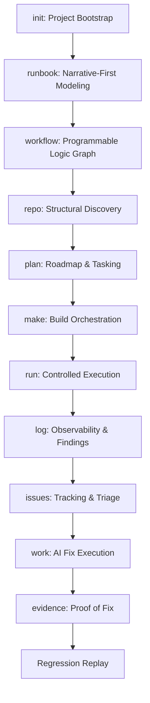

# Maestro Functional Interconnection Map

## The Meta Pipeline Flow

## Key Data Hand-offs

### 1. `runbook` -> `workflow`
- **Mechanism**: `workflow synthesis`.
- **Data**: Narrative command sequences are converted into state nodes and transition edges.
- **Context**: AI suggestions normalize fragmented ideas into a coherent logic graph.

### 2. `log scan` -> `issues`
- **Mechanism**: Finding Promotion.
- **Data**: A parsed compiler error or runtime crash log entry is wrapped in metadata (fingerprint, file, line) to create a `MaestroIssue`.

### 3. `issues` -> `work` / `plan`
- **Mechanism**: Linking.
- **Data**: An Issue can be promoted to a `Task` in the Plan or directly targeted by a `Work Session`.
- **Context Propagation**: The AI receives the original log finding and reproducibility steps as starting context.

### 4. `make` -> `tu`
- **Mechanism**: Build Trace.
- **Data**: The build process captures the exact compiler flags and includes used for each file, populating the Translation Unit (TU) cache.

### 5. `work` -> `evidence`
- **Mechanism**: State Collection.
- **Data**: AI breadcrumbs, modified file diffs, and successful build/test logs are packaged into an Evidence Pack for audit.

## Shared Persistence Layers
- **The AI Cache**: Shared between `ai chat`, `work`, and `discuss`.
- **The Plan Cache**: Shared between `plan`, `technology`, and `automation runners`.
- **The Log Database**: Historical findings queryable by `issues` and `log` views.
